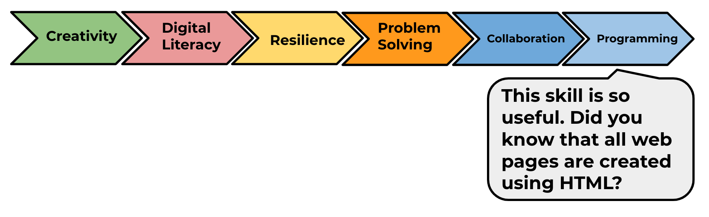

--- challenge ---
## Challenge: Create a New Showcase

Trinkets aren't the only thing you can embed in a webpage. You can embed videos, widgets (such as a weather widget) or Scratch projects. 

Open the Embed Scratch Example trinket and Run it: <a href="https://trinket.io/html/9f7212b8fe">https://trinket.io/html/9f7212b8fe</a>

Go to the Scratch website and find a project that you like. It can be one of your own or one you've found.

If you are logged in you can click the 'Embed' button below the project to get the HTML embed code. 

If you are not logged in then look for the Scratch project number in its web address. 

Make a copy of the `<iframe>` code in the Scratch Embed example and change the project number to the one for the project you want to embed:

--- /challenge ---

Click on the 'Click me' button to complete the Plenary for this module. Then start another module and learn something completely new. 

<a href="hhttps://codeclub.org/en/projects-cc">

