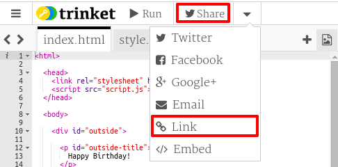
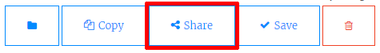

## Link to A Trinket

You can link to the web page for a trinket. 

+ Did you keep a link to your Happy Birthday trinket? If you did then open that trinket in another browser tab or window. Otherwise open the finished example trinket: <a href="https://trinket.io/html/e996dc0380">https://trinket.io/html/e996dc0380</a>

+ Click on the Share menu above your trinket and choose Link:

If you opened the trinket from your account then look for the Share option above your trinket instead:

+ Choose 'Only show code or result (let users toggle between them)' and copy the link to the trinket. 

+ Go back to your Project Showcase trinket and add an `<h2>` heading and a link to your Happy Birthday Project.

Test your webpage; it should look something like this:

Click the Happy Birthday link to test that it takes you to the trinket.

