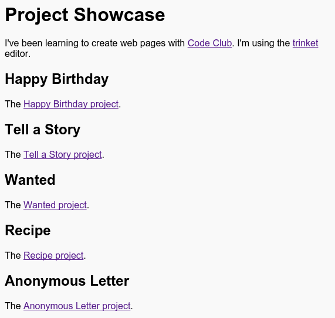

--- challenge ---
## Challenge: Create a List of Your Projects

Add some of the other HTML &amp; CSS projects that you have created at Code Club. Use `<h2>` headings to organise your webpage.

If you don't have links to the projects you created then you can use the Code Club examples:

+ Happy Birthday: <a href="https://trinket.io/html/e996dc0380">https://trinket.io/html/e996dc0380</a>

+ Tell a Story: <a href="https://trinket.io/html/c8afdef912">https://trinket.io/html/c8afdef912</a>

+ Wanted: <a href="https://trinket.io/html/ebeb56398a">https://trinket.io/html/ebeb56398a</a>

+ Recipe: <a href="https://trinket.io/html/c0fd9b40cd">https://trinket.io/html/c0fd9b40cd</a>

+ Mystery Letter: <a href="https://trinket.io/html/1d4d4c5ce1">https://trinket.io/html/1d4d4c5ce1</a>

Your finished page should look something like this:

--- /challenge ---